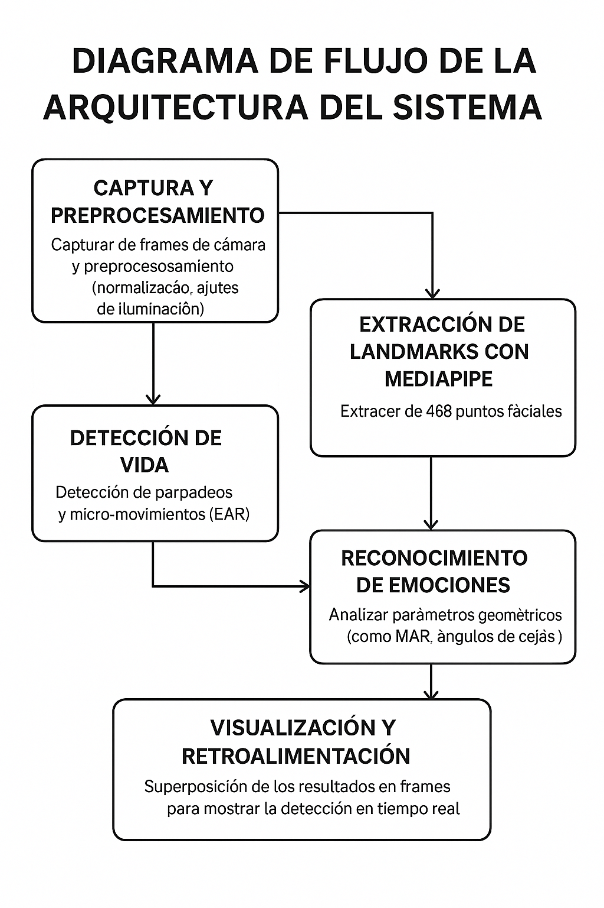

# Documentación: Detección de vida  y Reconocimiento de Emociones Faciales

Esta documentación describe de manera detallada y paso a paso cómo desarrollar un sistema que permita:
- **Verificar que la persona está viva** (detección de *vida*).
- **Reconocer la emoción básica** que la persona está expresando.

El sistema se basa en la utilización de **MediaPipe Face Mesh** para extraer los landmarks faciales, y en técnicas geométricas y de machine learning para analizar los movimientos y expresiones faciales.

---

## 1. Introducción

El propósito principal de este sistema es mejorar la seguridad y la interacción en aplicaciones de reconocimiento facial, garantizando que se está tratando con una persona real y, además, interpretar sus estados emocionales. 
---

## 2. Requisitos y Dependencias

- **Lenguaje:** Python 3.x
- **Librerías:**  
  - [MediaPipe](https://mediapipe.dev/) – para la detección y seguimiento de landmarks faciales.
  - [OpenCV](https://opencv.org/) – para capturar y procesar imágenes en tiempo real.
  - [NumPy](https://numpy.org/) – para el manejo y cálculo de datos numéricos.
  - (Opcional) Librerías de visualización, como Matplotlib, para representar gráficos y resultados.

## 3. Arquitectura del Sistema

El sistema se compone de los siguientes módulos:

1. **Captura y Preprocesamiento:**
   - Captura de frames de la cámara con OpenCV.
   - Normalización y ajustes de iluminación.
2. **Extracción de Landmarks con MediaPipe:**
   - Uso de MediaPipe Face Mesh para extraer 468 puntos de referencia.
   - Identificación de regiones clave: ojos, boca, cejas y contorno facial.
3. **Detección de Vida:**
   - Análisis de parpadeos y micro-movimientos.
   - Cálculo del Eye Aspect Ratio (EAR) para detectar actividad ocular.
4. **Reconocimiento de Emociones:**
   - Análisis de la apertura y forma de la boca (Mouth Aspect Ratio, MAR), ángulos de las cejas y la forma de los ojos.
   - Clasificación mediante reglas heurísticas o modelos de machine learning.
5. **Visualización y Retroalimentación:**
   - Superposición de landmarks y etiquetas de emoción en los frames.
   - Indicadores visuales para confirmar la detección de vida y la emoción.

> **Imagen sugerida:** Diagrama de flujo de la arquitectura del sistema.  

---

## 4. Detección de Vida (Liveness Detection)

### 4.1. Concepto y Objetivo

La detección de vida busca asegurar que la imagen capturada corresponde a una persona real, verificando la presencia de movimientos naturales, como parpadeos y micro-movimientos faciales.

### 4.2. Pasos para la Detección de Vida

#### 4.2.1. Captura y Preprocesamiento

- **Captura de Frame:**  
  Utilizar OpenCV para capturar imágenes en tiempo real desde la cámara.

- **Normalización:**  
  Realizar ajustes de iluminación y redimensionar la imagen para optimizar la detección de landmarks.

> **Imagen sugerida:** Flujo de captura y preprocesamiento de un frame.  
> _[Imagen pendiente de generación: Ejemplo de preprocesamiento de imagen]_

#### 4.2.2. Extracción de Landmarks

- **Uso de MediaPipe Face Mesh:**  
  Procesar el frame para obtener 468 puntos faciales que representan la estructura de la cara.

- **Selección de Regiones Clave:**  
  Enfocarse en los ojos (para calcular el EAR) y otros puntos relevantes que permitan analizar movimientos faciales.

> **Imagen sugerida:** Ejemplo de un rostro con landmarks extraídos.  
> _[Imagen pendiente de generación: Rostro con puntos de referencia resaltados]_

#### 4.2.3. Cálculo del Eye Aspect Ratio (EAR)

- **Definición:**  
  El EAR es la razón entre la distancia vertical y la distancia horizontal de los ojos.

- **Proceso:**
  1. **Selección de puntos:**  
     Elegir puntos específicos en el contorno superior e inferior de cada ojo.
  2. **Cálculo de distancias:**  
     - Medir la distancia vertical entre los puntos seleccionados.  
     - Medir la distancia horizontal entre los extremos laterales del ojo.
  3. **Aplicación de la fórmula:**

     \[
     EAR = \frac{\text{Distancia Vertical}}{\text{Distancia Horizontal}}
     \]

- **Umbral:**  
  Si el valor del EAR cae por debajo de un umbral predefinido durante un corto período, se detecta un parpadeo, lo que confirma actividad y, por ende, vida.

> **Imagen sugerida:** Diagrama del cálculo del EAR con ejemplos de puntos y fórmula.  
> _[Imagen pendiente de generación: Diagrama explicativo del EAR]_

#### 4.2.4. Análisis Temporal

- **Secuencia de Frames:**  
  Se analizan múltiples frames para evaluar la frecuencia y duración de los parpadeos.

- **Criterio de Vida:**  
  La detección recurrente de parpadeos y micro-movimientos confirma que la persona frente a la cámara está viva.

---

## 5. Reconocimiento de Emociones

### 5.1. Emociones Básicas

El sistema está diseñado para identificar las siguientes emociones básicas:
- **Felicidad**
- **Tristeza**
- **Sorpresa**
- **Miedo**
- **Enojo**
- **Disgusto**

### 5.2. Fundamento del Reconocimiento de Emociones

El reconocimiento de emociones se basa en el análisis de la relación geométrica y dinámica de las siguientes regiones:

- **Boca:**  
  - **Mouth Aspect Ratio (MAR):**  
    Mide la apertura de la boca. Una apertura amplia puede indicar sorpresa, mientras que una leve curvatura ascendente puede reflejar felicidad.

- **Cejas:**  
  - **Elevación y angulación:**  
    Cejas elevadas pueden asociarse con sorpresa, mientras que cejas fruncidas pueden indicar enojo o tristeza.

- **Ojos:**  
  - **Forma y apertura:**  
    La forma y el tamaño de los ojos complementan la detección, ayudando a distinguir emociones como miedo o sorpresa.

### 5.3. Pasos para el Reconocimiento de Emociones

#### 5.3.1. Extracción de Regiones de Interés

- **Identificar landmarks:**  
  Utilizar MediaPipe para extraer los puntos de referencia en las regiones de la boca, cejas y ojos.
- **Selección de puntos clave:**  
  Seleccionar aquellos puntos que permitan calcular los ratios y ángulos necesarios para el análisis (por ejemplo, puntos en los bordes y centro de la boca para calcular el MAR).

> **Imagen sugerida:** Ejemplo de selección de puntos en la boca y cejas.  
> _[Imagen pendiente de generación: Rostro con regiones de interés resaltadas]_

#### 5.3.2. Cálculo de Parámetros Geométricos

- **Mouth Aspect Ratio (MAR):**  
  1. Calcular la distancia vertical entre los puntos superior e inferior de la boca.
  2. Calcular la distancia horizontal entre los extremos laterales.
  3. Aplicar una fórmula similar al EAR para determinar la apertura.
- **Ángulos de las Cejas:**  
  1. Medir la inclinación de las cejas con respecto a una línea horizontal de referencia.
  2. Comparar los ángulos obtenidos con los de una posición neutral.

> **Imagen sugerida:** Diagrama explicativo del cálculo del MAR y medición de ángulos de cejas.  
> _[Imagen pendiente de generación: Diagrama explicativo de MAR y ángulos de cejas]_

#### 5.3.3. Clasificación de Emociones

Existen dos enfoques para la clasificación de emociones:

1. **Reglas Heurísticas:**
   - Definir umbrales para cada parámetro basado en estudios y pruebas empíricas.
   - Ejemplos:
     - **Felicidad:** MAR moderado con curvatura ascendente en las comisuras de la boca.
     - **Tristeza:** MAR bajo, comisuras hacia abajo y cejas caídas.
     - **Sorpresa:** MAR alto, cejas elevadas y ojos muy abiertos.
     - **Miedo:** Ojos muy abiertos y cejas ligeramente arqueadas.
     - **Enojo:** Ojos entrecerrados, cejas fruncidas y boca tensa.
     - **Disgusto:** Expresiones asociadas a cejas y nariz arrugados.
2. **Modelos de Machine Learning:**
   - Extracción de características a partir de los parámetros geométricos.
   - Entrenamiento de un modelo (como SVM, Random Forest o una red neuronal) con un dataset etiquetado.
   - Validación y ajuste del modelo para mejorar la precisión.

#### 5.3.4. Integración y Retroalimentación

- **Visualización en Tiempo Real:**  
  Superponer sobre el frame de video los landmarks, indicadores de vida y la etiqueta de la emoción detectada.
- **Calibración Dinámica:**  
  Ajustar umbrales y parámetros en función de las condiciones del entorno (iluminación, distancia) para mejorar la precisión.

> **Imagen sugerida:** Ejemplo de visualización en pantalla con superposición de landmarks y etiqueta de emoción.  
> _[Imagen pendiente de generación: Frame de video con superposición de landmarks y etiqueta de emoción]_

---

## 6. Flujo de Implementación Paso a Paso

### Paso 1: Inicialización del Sistema
- Configurar la cámara utilizando OpenCV.
- Inicializar MediaPipe Face Mesh para la detección de landmarks.
- Definir y calibrar parámetros iniciales (umbral de EAR, MAR y ángulos).

### Paso 2: Captura de Frames y Preprocesamiento
- Capturar el frame actual de la cámara.
- Aplicar técnicas de normalización y ajuste de iluminación.

### Paso 3: Extracción de Landmarks
- Procesar el frame mediante MediaPipe para obtener 468 puntos faciales.
- Identificar y extraer las regiones de interés (ojos, boca, cejas).

### Paso 4: Cálculo de Indicadores de Vida
- Calcular el EAR para cada ojo.
- Analizar la secuencia de parpadeos y micro-movimientos.
- Validar la presencia de vida mediante la detección recurrente de parpadeos.

### Paso 5: Cálculo de Parámetros para el Reconocimiento de Emociones
- Medir el MAR y calcular la apertura de la boca.
- Medir ángulos e inclinaciones de las cejas.
- Evaluar la forma y apertura de los ojos.

### Paso 6: Clasificación y Decisión
- Aplicar reglas heurísticas o un modelo de machine learning para clasificar la emoción.
- Combinar la información de vida y de emoción para generar la salida final.

### Paso 7: Visualización y Retroalimentación
- Superponer en el video los landmarks y las etiquetas correspondientes.
- Mostrar indicadores visuales que confirmen la detección de vida y la emoción detectada.

---

## 7. Consideraciones Finales y Buenas Prácticas

- **Calibración:**  
  Es fundamental calibrar los umbrales (EAR, MAR, ángulos) según la población objetivo y las condiciones ambientales.

- **Robustez:**  
  El sistema debe adaptarse a variaciones en iluminación, ángulo y distancia de la cámara.

- **Optimización en Tiempo Real:**  
  Asegurar que el procesamiento es eficiente para una respuesta en tiempo real, utilizando técnicas de optimización y, si es necesario, procesamiento en GPU.

- **Entrenamiento y Validación:**  
  Si se utiliza un modelo de machine learning, es crucial contar con un dataset representativo y realizar pruebas exhaustivas para minimizar falsos positivos o negativos.

- **Integración y Mantenimiento:**  
  Garantizar que la solución se integre de manera coherente en el sistema final, con actualizaciones periódicas basadas en feedback.

---

## 8. Conclusión

La integración de MediaPipe Face Mesh con análisis geométrico y técnicas de machine learning permite desarrollar un sistema robusto para:
- Verificar que la persona frente a la cámara está viva.
- Reconocer de forma precisa las emociones básicas que se están expresando.

Cada paso y módulo del sistema es esencial para garantizar su precisión y eficiencia, facilitando su uso en aplicaciones de seguridad e interacción humana.
